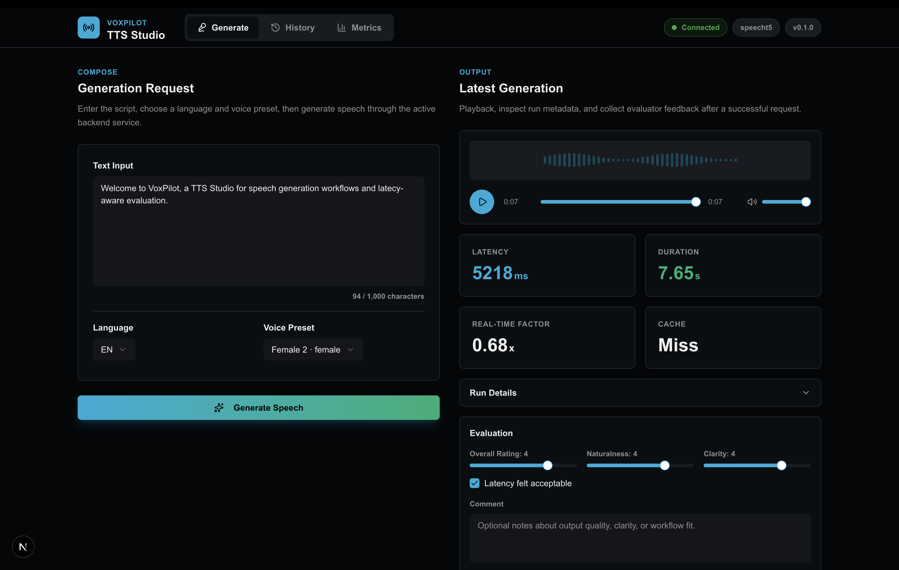
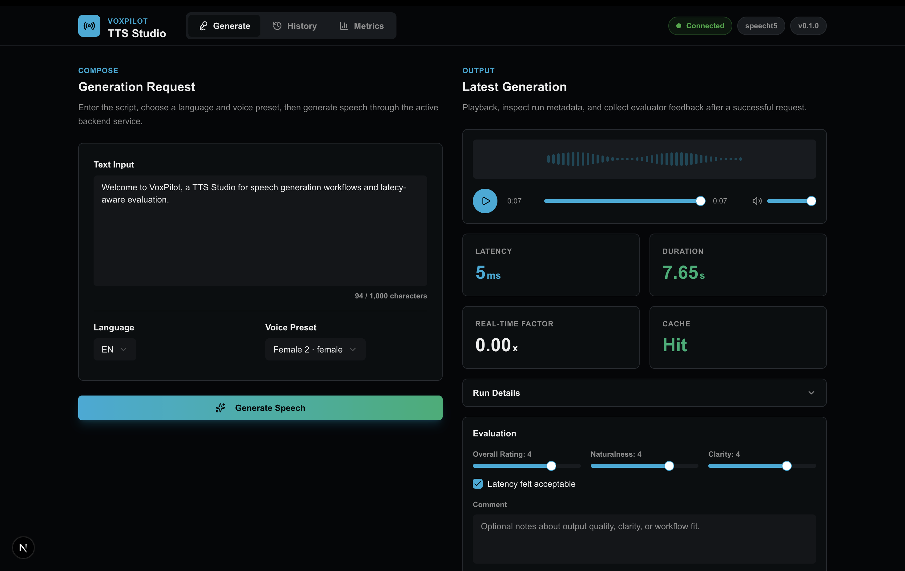
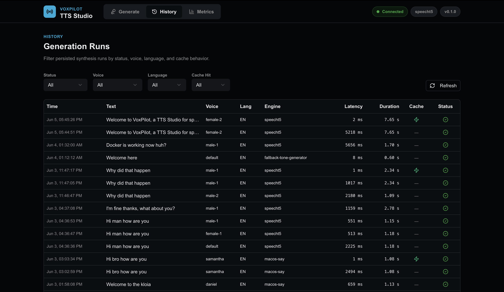
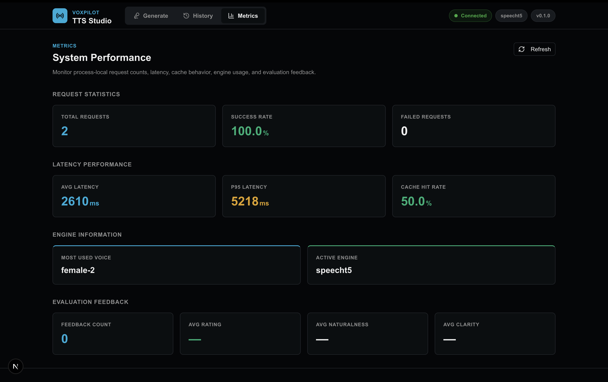

# VoxPilot — Production-Oriented TTS / Voice AI Studio PoC

**VoxPilot** is a focused Text-to-Speech / Voice AI Studio proof of concept built to demonstrate how I would approach the product-platform layer of an ElevenLabs-like voice AI initiative: reliable API contracts, a usable studio interface, swappable model/provider integration, run history, caching, latency metrics, feedback collection, testing, containerization, and an AWS-ready deployment path.

This project is intentionally not positioned as a full ElevenLabs clone. The goal is to show that the surrounding platform needed for a real voice AI product can be designed cleanly from day one, while keeping the TTS engine replaceable as the model/provider strategy evolves.

---

## Screenshots

### Generate Speech

VoxPilot provides a clean TTS generation interface where users can enter text, select language and voice presets, and generate speech through the active backend engine.

<table>
  <tr>
    <td width="50%">
      
      <br />
      <sub>Initial generation with latency, duration, real-time factor, and cache miss status.</sub>
    </td>
    <td width="50%">
      
      <br />
      <sub>Cached generation with near-instant latency and cache hit status.</sub>
    </td>
  </tr>
</table>

### Generation History

Track previous synthesis runs with request metadata such as voice, language, engine, latency, duration, cache behavior, and status.



### System Metrics

Monitor request statistics, latency performance, cache hit rate, engine usage, and evaluator feedback.



## Why I Built This

After discussing a possible ElevenLabs-like product direction, I wanted to prepare a concrete prototype that shows more than interest in the domain. VoxPilot is my attempt to make that interest tangible through working code.

The project focuses on the parts that are critical in production voice AI systems:

- stable synthesis APIs,
- low-friction product workflow,
- observable inference behavior,
- reusable TTS engine abstraction,
- persisted generation history,
- quality feedback collection,
- testable service boundaries,
- Dockerized local serving,
- and a credible AWS migration path.

In other words, this is not only a model demo. It is a small product and platform skeleton for a real voice AI system.

---

## Current Capabilities

### Product / UX

- Modern **Next.js TTS Studio** frontend.
- Text-to-speech generation workflow.
- Voice and language selection from backend-provided presets.
- Generated audio playback with custom player controls.
- Run details shown after generation: run ID, engine, voice, language, latency, cache status, and audio path.
- Feedback form for generated speech quality evaluation.
- History page with persisted synthesis runs and filters.
- Metrics page for system and evaluation signals.
- Optional Streamlit studio UI is also available in the backend folder.

### Backend / Platform

- **FastAPI** service for synthesis, voices, audio serving, run history, feedback, and metrics.
- Swappable `TTSEngine` abstraction.
- Supported engines:
  - `speecht5` for optional ML-backed TTS,
  - `system` / `macos-say` for local macOS speech,
  - `fallback` for dependency-light demo behavior,
  - `fake` for deterministic tests and CI.
- SQLite persistence for generation runs and feedback.
- Deterministic request cache for repeated synthesis requests.
- Latency, success/failure, cache-hit, voice-usage, and feedback summary metrics.
- Structured JSON logging suitable for cloud environments.
- Input validation and basic safety boundaries.
- Docker and Docker Compose support.
- Pytest coverage across API behavior, service orchestration, cache, storage, metrics, feedback, content guardrails, and frontend/backend contract expectations.

---

## Architecture

```text
Next.js Frontend
    -> FastAPI Backend
        -> SynthesisService
            -> TTSEngine abstraction
                -> SpeechT5 / macOS system speech / fallback / fake test engine
            -> CacheService
            -> MetricsService
            -> RunRepository
                -> SQLite generation_runs
                -> SQLite feedback
            -> Generated WAV files
```

Key design idea: the UI and API contract stay stable even if the speech engine changes. That makes it possible to start with a local/open-source engine, then later switch to Amazon Polly, SageMaker-hosted TTS, a self-hosted model endpoint, or another production speech provider without rewriting the product workflow.

---

## Repository Structure

```text
VoxPilot_All/
├── Backend/
│   ├── app/
│   │   ├── main.py                 # FastAPI routes and dependency wiring
│   │   ├── services/               # synthesis, cache, metrics services
│   │   ├── storage/                # SQLite database and repositories
│   │   ├── tts/                    # TTS engine interface and implementations
│   │   ├── utils/                  # audio, hashing, timing helpers
│   │   └── schemas.py              # API request/response models
│   ├── tests/                      # backend tests
│   ├── docs/aws_architecture.md    # AWS production migration path
│   ├── ui/streamlit_app.py         # optional Streamlit studio
│   ├── requirements.txt
│   ├── requirements-ml.txt
│   ├── Dockerfile
│   ├── docker-compose.yml
│   └── Makefile
│
└── Frontend/
    ├── app/
    │   ├── page.tsx                # generation studio
    │   ├── history/page.tsx        # run history dashboard
    │   └── metrics/page.tsx        # metrics dashboard
    ├── components/                 # reusable UI components
    ├── lib/api.ts                  # typed backend client
    ├── lib/types.ts                # API response types
    ├── package.json
    └── pnpm-lock.yaml
```

---

## Quickstart

### 1. Run the Backend

From the backend folder:

```bash
cd Backend

python -m venv .venv
source .venv/bin/activate

python -m pip install uv
uv pip install -r requirements.txt
make install-ml
make run-api
```

The API will run at:

```text
http://localhost:8000
```

Useful backend URLs:

```text
http://localhost:8000/health
http://localhost:8000/docs
http://localhost:8000/voices
http://localhost:8000/metrics
```

For a lighter local demo without ML dependencies, use the fallback engine:

```bash
VOXPILOT_ENGINE=fallback make run-api
```

### 2. Run the Frontend

Open a separate terminal:

```bash
cd Frontend

pnpm install
pnpm dev
```

The frontend will run at:

```text
http://localhost:3000
```

The frontend expects the backend at `http://localhost:8000` by default. To override it, create a local environment file:

```bash
cp .env.example .env.local
```

Then update:

```env
NEXT_PUBLIC_VOXPILOT_API_URL=http://localhost:8000
```

---

## Demo Flow for Reviewers

1. Start the FastAPI backend.
2. Start the Next.js frontend.
3. Open the Generate page.
4. Enter a text prompt and generate speech.
5. Listen to the generated WAV output.
6. Check the run metadata: latency, engine, voice, cache hit, and run ID.
7. Submit feedback for naturalness, clarity, latency acceptability, and overall rating.
8. Open the History page to inspect persisted generation runs.
9. Open the Metrics page to inspect service-level and feedback-level signals.
10. Repeat the same prompt to observe cache behavior.

This flow is designed to highlight the core loop of a production voice AI product: generate, measure, evaluate, persist, and iterate.

---

## API Overview

### System

```http
GET /health
```

Returns service health, active engine, version, and timestamp.

### Voices

```http
GET /voices
```

Returns the voice presets exposed by the active TTS engine.

### Synthesis

```http
POST /synthesize
```

Accepts form data:

| Field | Required | Description |
|---|---:|---|
| `text` | Yes | Input text to synthesize. |
| `language` | No | Language code. Defaults to `en`. |
| `voice` | No | Voice preset. Defaults to `default`. |
| `style` | No | Optional style hint accepted by the API contract. |
| `metadata` | No | Optional JSON metadata string. |

Example response:

```json
{
  "success": true,
  "run_id": "generated-run-id",
  "audio_path": "data/generated/generated-run-id.wav",
  "audio_url": "/audio/generated-run-id.wav",
  "latency_ms": 1234.56,
  "audio_duration_seconds": 2.31,
  "real_time_factor": 0.53,
  "cache_hit": false,
  "engine": "speecht5",
  "voice": "default",
  "language": "en"
}
```

### Audio

```http
GET /audio/{filename}
```

Serves generated WAV output.

### History

```http
GET /runs
```

Supports filters such as `status`, `voice`, `language`, `cache_hit`, and `limit`.

### Feedback

```http
POST /feedback
GET /feedback/summary
```

Example feedback payload:

```json
{
  "run_id": "generated-run-id",
  "rating": 5,
  "naturalness": 4,
  "clarity": 5,
  "latency_acceptability": true,
  "comment": "Clear output and acceptable latency for this prompt."
}
```

### Metrics

```http
GET /metrics
```

Returns request counts, success/failure counts, average latency, p95 latency, cache-hit data, most-used voice, and aggregated feedback metrics.

---

## Testing

From the backend folder:

```bash
cd Backend
source .venv/bin/activate
make test
```

CI-style deterministic test run:

```bash
VOXPILOT_ENGINE=fake make ci
```

Compile/import check:

```bash
make lint
```

Current backend test status while preparing this README:

```text
58 passed, 1 skipped
```

The test suite uses the fake engine where appropriate, so it does not depend on downloading model assets or producing real speech during CI.

---

## Docker Usage

From the backend folder:

```bash
cd Backend
docker compose up --build
```

Default Docker mode uses the lightweight fallback engine:

```text
VOXPILOT_ENGINE=fallback
```

Services:

```text
API: http://localhost:8000/health
Next.js Frontend: http://localhost:3000
Optional Streamlit UI: http://localhost:8501
```

To run the FastAPI backend and Next.js frontend together:

```bash
VOXPILOT_ENGINE=speecht5 docker compose up --build api frontend
```

The Dockerized frontend defaults to calling the published backend URL:

```env
NEXT_PUBLIC_VOXPILOT_API_URL=http://localhost:8000
```

That value is intentionally browser-facing. Use `http://api:8000` only for
container-to-container server calls, such as the optional Streamlit UI.

To build with optional ML dependencies explicitly:

```bash
docker compose build --build-arg INSTALL_ML=true
VOXPILOT_ENGINE=speecht5 docker compose up
```

For a smaller fallback-only image, set:

```bash
INSTALL_ML=false docker compose build api
```

---

## Configuration

Backend configuration is loaded with the `VOXPILOT_` prefix. Copy `.env.example` inside the backend folder if local overrides are needed.

Important backend settings:

| Variable | Default | Description |
|---|---|---|
| `VOXPILOT_ENGINE` | `speecht5` | Active engine: `speecht5`, `system`, `fallback`, or `fake`. |
| `VOXPILOT_MAX_TEXT_LENGTH` | `1000` | Maximum accepted input length. |
| `VOXPILOT_AUDIO_DIR` | `data/generated` | Generated WAV output directory. |
| `VOXPILOT_DB_PATH` | `data/voxpilot.db` | SQLite database path. |
| `VOXPILOT_LOG_LEVEL` | `INFO` | Logging level. |
| `VOXPILOT_HOST` | `0.0.0.0` | API bind host. |
| `VOXPILOT_PORT` | `8000` | API port. |
| `VOXPILOT_APP_VERSION` | `0.1.0` | Backend version string. |

Frontend configuration:

| Variable | Default | Description |
|---|---|---|
| `NEXT_PUBLIC_VOXPILOT_API_URL` | `http://localhost:8000` | FastAPI backend base URL. |

---

## Design Decisions

### 1. Engine Abstraction First

The backend does not hard-code a single TTS implementation into the product flow. Every engine implements the same `TTSEngine` contract. This keeps the synthesis API, frontend, metrics, and feedback workflow stable even if the underlying speech provider changes.

### 2. Product Loop, Not Only Inference

Voice AI products need more than generated audio. They need user workflows, run traceability, latency data, feedback signals, and a way to evaluate quality over time. VoxPilot includes those pieces as first-class concepts.

### 3. Deterministic Testing Path

The `fake` engine allows backend tests to run quickly and deterministically without downloading ML models. This makes CI practical and prevents test stability from depending on external model availability.

### 4. Local PoC, Cloud-Aware Boundaries

SQLite and local WAV files are enough for a local PoC. The code is structured so those can later move to PostgreSQL/RDS and S3 without changing the external API contract.

### 5. Honest Scope Boundaries

This project does not implement voice cloning or reference-audio-based speaker similarity. It also does not claim to be a commercial TTS platform. It demonstrates the product/platform foundation around a voice AI system and leaves room for deeper modeling work.

---

## AWS Production Path

A production-oriented AWS version would likely use:

- **ECS Fargate** or **AWS App Runner** for the FastAPI service,
- a separately deployed internal demo UI,
- **S3** for generated audio assets,
- **RDS PostgreSQL** for run history and feedback,
- **CloudWatch Logs and Metrics** for observability,
- **Secrets Manager** or **SSM Parameter Store** for configuration,
- **ECR** for container images,
- and a TTS provider behind the existing engine abstraction.

Possible engine strategies:

- Amazon Polly for managed TTS,
- SageMaker endpoint for a custom model,
- self-hosted TTS model service,
- or another external speech provider wrapped behind the `TTSEngine` interface.

A more detailed sketch is available in:

```text
Backend/docs/aws_architecture.md
```

---

## Current Limitations

- The fallback engine is for demo reliability and does not produce natural speech.
- SpeechT5 dependencies are optional and may download model assets on first use.
- Cache and metrics are process-local in the current PoC.
- SQLite is used for local persistence; production should use PostgreSQL or another managed database.
- Generated audio is stored locally; production should use S3 with retention policies and signed URLs.
- Authentication, rate limiting, quotas, streaming inference, and multi-tenant isolation are not implemented yet.
- Voice cloning and reference-audio workflows are intentionally out of scope for the current version.

---

## What I Would Build Next

If continuing this toward a production voice AI product, my next steps would be:

1. Replace local audio storage with S3 and signed playback URLs.
2. Add PostgreSQL/RDS support for runs and feedback.
3. Add authentication, rate limiting, and per-user quotas.
4. Add async job handling for long synthesis requests.
5. Add streaming audio generation where supported by the engine.
6. Add richer evaluation dashboards and prompt/voice comparison workflows.
7. Add CloudWatch metric emission and p95/p99 latency alarms.
8. Add load tests for synthesis latency and cache behavior.
9. Add a provider adapter for Amazon Polly or a SageMaker-hosted model.
10. Add a clear model evaluation pipeline for naturalness, clarity, latency, and user feedback trends.

---

## Tech Stack

### Backend

- Python
- FastAPI
- Pydantic
- Uvicorn
- SQLite
- Pytest
- Docker
- Optional SpeechT5 / Transformers dependencies

### Frontend

- Next.js
- React
- TypeScript
- SWR
- Tailwind CSS
- shadcn-style UI components
- pnpm

### Platform Direction

- AWS ECS / App Runner
- S3
- RDS PostgreSQL
- CloudWatch
- ECR
- Secrets Manager / SSM
- Optional SageMaker or Amazon Polly integration

---

## Author

**Furkan Egecan Nizam**  
Computer Engineering student focused on AI engineering, MLOps, production-oriented AI systems, and cloud-ready software architecture.

This project was built as a focused technical PoC to demonstrate fast adaptation to the voice AI domain and the ability to think beyond model inference into product delivery, observability, evaluation, and deployment readiness.
